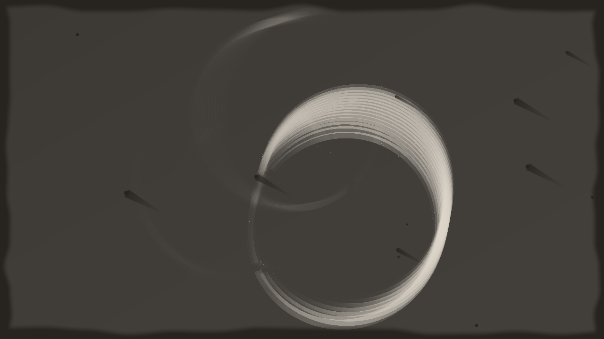

# wetplate

> **AI-assisted project.** This codebase was created with [Claude](https://claude.com/claude-code)
> (Anthropic), directed and reviewed by a human author. The plate is not asserted but
> measured: an offline harness drives the real plugin class in a headless GL context
> on a synthetic clock and reads each claim back out of the picture — pure red, green
> and blue expose the plate in the ratio of weights computed from a published
> collodion sensitivity curve and Smits' RGB-to-spectrum basis (red 7%, green 2%,
> blue 98% of white), a square moving two pixels a frame leaves a smear each column
> of which is exposed for exactly the fraction of the window it was covered, the
> bucketed window is the exact per-frame box mean to within one bucket's edge, a
> grey wedge maps through the stated characteristic curve to 6e-7 in density, the
> coating along the drain axis is a + b√s with a and b what the drainage law says,
> a take stops changing on exactly the frame Exposure seconds after the event, and a
> resize mid-exposure carries the exposure so far across — with seven negative
> controls that prove each check can fail. It has **never been loaded into
> Resolume**; it is loaded by [oxbow](https://github.com/stoatworks-labs/oxbow),
> which is a real FFGL host and is not Resolume. See [Status](#status).

A collodion wet plate — blue-sensitive and seconds long — as an FFGL effect for
[Resolume](https://resolume.com) Arena and Avenue.



<sub>One frame, rendered by `wttest --pipe`, the offline harness — not captured from
Resolume. Resolume's bundled demo clip on the default tintype, half a second of
exposure.</sub>

## The one idea

A wet collodion plate (1850s–80s, and the tintype revival) is silver halide in
collodion, exposed while wet. Two properties make the look, and both are in the
plate, not in a grade.

**It sees only ultraviolet and blue.** Its spectral sensitivity ends around 500 nm.
So the plate's exposure is not the clip's brightness: it is the clip's light,
weighted by a curve digitised from a published measurement of a collodion plate
and integrated against a spectrum built from each pixel's RGB. Red light barely
registers, so reds and skin render dark; a blue sky is blown to white.

**It is slow.** Exposures run for seconds. The plate integrates light for the whole
exposure, so anything that moved is a translucent ghost in proportion to how long
it stayed, and anything that held still is sharp.

Then it was hand-poured, so the coating is thicker where it drained, bare where the
pour never reached, and marked where dust kept the silver bath off.

## What falls out

None of these is drawn. Each is one stage of the plate doing what it does:

- **Reds go black, skies go white.** From the spectral weighting alone: under
  daylight, pure red exposes the plate to 7% of white, pure green to 2%, pure blue
  to 98%. A red neon is a dark shape; a cream skull is white.
- **Motion becomes a ghost** with density exactly the fraction of the exposure a
  thing spent in one place. A ring on an orbit stacks into a spiral. The window is a
  sliding box of `Exposure` seconds, held as a ring of `Buckets` bucket sums so
  memory is a fixed number of frames at any exposure; the window is exact to one
  bucket's width, and the harness measures that bound.
- **A take.** In `Take` mode the plate is capped until the `Take` event, integrates
  for `Exposure` seconds, and then holds the developed plate.
- **Pour marks.** The coating thickness follows thin-film drainage — √s along the
  path from the `Pour` corner to its opposite — and density scales with it, so the
  drain corner is heavier and the pour corner thin. `Bare Edge` is where the pour
  never reached; `Defects` are dust specks and comets whose tails run down the
  drain.
- **The plate.** A tintype (silver over black japanned iron, warm), an ambrotype
  (silver over black glass, cooler) or a glass negative on a light box.

### The honest limit

The plate sees a spectrum built from three numbers per pixel, so the spectral
weighting is Smits' smooth reconstruction of an RGB, not the scene's real spectrum,
and the ultraviolet the plate also sees is absent because a clip's pixels say
nothing about it. The sensitivity curve is digitised from a published figure to
about ±0.03, not taken from a table. The lights are Planckian radiators at the
CIE's colour temperatures rather than the CIE daylight tables. The characteristic
curve is a stated shape with numbers chosen inside the published picture of a
high-contrast, short-latitude material, not fitted to a measured plate. Grain is
not modelled: collodion is extremely fine-grained, and at video rasters it would
be below a pixel. The bare edge and the comets are seeded shapes, not a fluid
simulation.

## Controls

| Group | |
| --- | --- |
| **Plate** | Plate (Tintype, Ambrotype, Negative), Light (Daylight, Tungsten, Flash), Development (γ 0.6–2.4), Sensitivity (±3 stops). |
| **Exposure** | Exposure (1/16–16 s), Mode (Continuous, Take), Take (event), Buckets (2–16). |
| **Coating** | Pour (Top Left, Top Right, Bottom Left, Bottom Right), Coating Var, Bare Edge, Defects. |
| **Output** | Tone (neutral to warm), Vignette, Mix. |

The defaults are a tintype in daylight at the plate's stated γ of 1.2, half a
second of exposure in eight buckets, poured from the top left with a modest drain, a
little bare edge, a few defects, slightly warm. Half a second rather than the
seconds a real plate took, because on Resolume's demo clips a full second turned
every fast loop into streaks; `Exposure` goes to 16 s for a still subject.

## Status

**v0.1.0, and honestly early — 24 September 2026.**

### Measured offline, on macOS

`tools/verify.sh` passes on this machine (M4 Max, macOS 26.4) against a fresh
universal Release build, running every check at **two rasters**, 320×180 and
1280×720. What it establishes, in numbers:

| check | result |
| --- | --- |
| `--spectral` | under each of the three lights, pure red, green and blue expose the plate in the ratio of the computed weights to **3e-6** (tolerance from 2(n + 4) half-ULPs over n = 20 frames); white to 1 within 1e-7; in daylight red **0.074**, green **0.016**, blue **0.980** of white |
| `--ghost` | a 20 px square at 2 px/frame over a 30-frame window leaves a 78-column smear (w + v(n − 1)); every column reads (frames covered) / 30 within **2e-6**; the static square reads 1; black reads exactly 0 |
| `--bucket` | on every frame of a 31-frame run, the bucketed window is the exact 30-frame box mean within **0.1667** (the bound: 5 frames of one bucket's edge over 30), reaches exactly that bound, and equals the stated bucket rule to **2e-6**; the window's length is what the rule says on every frame |
| `--curve` | at three Developments (γ 0.6, 1.2, 2.4) every one of 41 steps is within **6e-7** of the stated curve (tolerance 1e-5); the floor reads fog and the ceiling fog + γL within the softplus residual; the mid-line secant sits in its derived band |
| `--drainage` | for all four pour corners, D/D₀ along the drain axis fits a + b√s with residual **2e-7** (tolerance 5e-5); a = 0.20000 (1 − 2V/3) and b = 1.20000 (V) to 1e-5 |
| `--take` | the plate reads exactly 0 before the take, changes on all 29 frames of the exposure, and from the frame Exposure seconds after the event is bit-identical for 41 frames |
| `--resize` | 30 frames of white, a resize to 1.5× and back, 30 of black: every pixel reads the exposure so far, 0.5, **exactly** (tolerance 4e-6) |
| `--negative` | six perturbed models — luma weights, one-frame integration, linear drainage, γ × 0.8, a resize that clears, a take that never ends — each **fails** its check |
| mutation | one character of the shipped GLSL (`sqrt( s ) - 2.0 / 3.0` → `sqrt( s ) + 2.0 / 3.0` in the coating) was caught by `--drainage`, then reverted |
| `tools/sweep.py` | all **15** controls measurably change the picture (Take under Take mode) |
| shaders | all 6, as the plugin assembles them, compile through `glslc`; no GLSL 4.10 reserved word as an identifier |
| weights | `source/Spectral.h` recomputes from the script's tables byte for byte; Smits' complementary pairs sum to white within 0.072 |
| `--pipe` | 2.5 frames in, exactly 2 out; an unknown cue refused; a closed stdout and a failed render exit 1; an option cue steps, an event cue fires on its frame |
| the bundle | universal (`x86_64 arm64`), exports `plugMain`, ad-hoc signs; `oxbow` reports `SW Wetplate` / `WT01` / `effect` and renders 120 frames through `plugMain` |

Render cost at the defaults, best of three runs of 60 frames after a warm-up,
`glFinish` both sides, on a GPU shared with other work: **0.12 ms** at 720p,
**0.29 ms** at 1080p, **1.14 ms** at 4K — under a tenth of a 60 fps frame. The
state held across frames, at the default eight buckets, is (Buckets + 2) R32F
frames: **35 MB** at 720p, **79 MB** at 1080p, **316 MB** at 4K, colour textures
only; the SDK's FBO adds a depth renderbuffer to each that the plugin never uses.
Sixteen buckets at 4K is 570 MB. macOS figures only.

### Not established

It has **never been loaded into Resolume**. Everything above was compiled, rendered
and measured offline against the real plugin class in a headless CGL context, plus
an `oxbow` load. How fifteen controls in four groups present in Arena's inspector,
whether the `Take` button reads as a shutter, and what the host's clock does to the
bucket grid over a long session are untested. The look has been seen on a synthetic
card and on eight of Resolume's bundled demo clips through `wttest --pipe`, never on
camera footage of people or places — which is where a blue-blind plate would show
most. No OpenFX port and no browser demo, not in scope for 0.1.0. Windows has never
been compiled.

## Build

Needs CMake 3.15+, a C++17 compiler, and the FFGL SDK submodule.

```bash
git clone --recursive https://github.com/stoatworks-labs/wetplate
cd wetplate
cmake -B build -DCMAKE_BUILD_TYPE=Release
cmake --build build --parallel
cmake --install build     # into ~/Documents/Resolume Arena/Extra Effects
```

macOS builds are universal (Apple Silicon + Intel) by default; add
`-DCMAKE_OSX_ARCHITECTURES=arm64` for a faster dev build. Windows needs GLEW via vcpkg.

## Building and testing

The offline harness renders the real plugin class headlessly, on a synthetic 60 fps
clock:

```bash
./build/wttest --out /tmp/frame.png --size 1920x1080   # the moving card
./build/wttest --list                                  # every control, kind and default
./build/wttest --spectral --ghost --bucket             # each claim, measured
./build/wttest --curve --drainage --take --resize
./build/wttest --negative                              # and the checks can fail
./build/wttest --bench                                 # 720p, 1080p, 4K, and the state held
python3 tools/sweep.py                                 # no control is silently dead
python3 tools/spectral_weights.py --check              # the weights recompute
tools/verify.sh                                        # all of it, on a fresh universal build
```

Every check takes `--size`; run it at 320×180 as well as the raster you care about.
Footage goes through the real shaders with `--pipe`, in the fleet's frame format:

```bash
ffmpeg -i in.mov -f rawvideo -pix_fmt rgba - \
  | ./build/wttest --pipe --size 1920x1080 --fps 30 --script cues.txt \
  | ffmpeg -f rawvideo -pix_fmt rgba -s 1920x1080 -i - out.mov
```

See [`CLAUDE.md`](CLAUDE.md) for the full command reference and
[`AGENTS.md`](AGENTS.md) for the model and the traps.

<!-- attributions:start -->
This project is built on other people's work — see [ATTRIBUTIONS.md](ATTRIBUTIONS.md).
<!-- attributions:end -->

## Licence

MIT — see [LICENSE](LICENSE).
